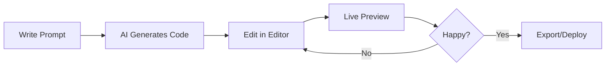

# 🌊 CodeVibe V2

> **The Next-Generation AI-Powered Coding Platform**
> Build, iterate, and deploy web applications with AI — faster than Replit, smarter than Lovable.

[](https://opensource.org/licenses/MIT)
[](https://reactjs.org/)
[](https://vitejs.dev/)
[](https://tailwindcss.com/)

---

## 🎯 Vision

**CodeVibe V2** is an AI-native development environment that empowers developers, activists, and creators to build web applications through natural language. No more context-switching between IDE, terminal, and browser — everything happens in one intelligent workspace.

### Why CodeVibe V2?

| Feature | Replit | Lovable | **CodeVibe V2** |
|---------|--------|---------|-----------------|
| **Multi-Agent System** | ⚠️ Basic | ⚠️ Basic | ✅ **5 Specialized Agents** |
| **Code Quality Review** | ❌ No | ⚠️ Limited | ✅ **Architect Agent (0-100 Score)** |
| **SEO Optimization** | ❌ No | ❌ No | ✅ **Full SEO Agent** |
| **Planning Phase** | ⚠️ Limited | ⚠️ Limited | ✅ **Dedicated Planning Agent** |
| **AI-First Architecture** | ⚠️ Bolted-on | ✅ Yes | ✅ **Native & Extensible** |
| **Real-Time Preview** | ✅ Yes | ✅ Yes | ✅ **Instant + Auto-Refresh** |
| **Privacy-First** | ❌ Cloud-only | ❌ Proprietary | ✅ **Self-Hostable** |
| **Custom AI Models** | ❌ No | ❌ No | ✅ **Gemini + Swap-Ready** |
| **Advocacy Use Cases** | ❌ No | ❌ No | ✅ **Rights-Tech Focused** |
| **Open Source** | ⚠️ Partial | ❌ No | ✅ **100% MIT** |
| **Mobile-First UX** | ⚠️ Limited | ⚠️ Limited | ✅ **Optimized** |

---

## 🚀 Quick Start

### Prerequisites
- **Node.js 18+** and **npm** (or **yarn**/pnpm)
- Modern browser (Chrome, Firefox, Safari, Edge)
- **Gemini API Key** (free tier available at [ai.google.dev](https://ai.google.dev))

### Installation

```bash
# Clone the repository
git clone https://github.com/patriotnewsactivism/AICodeAgent.git
cd AICodeAgent

# Install dependencies
npm install

# Start development server
npm run dev
```

🎉 **Open [http://localhost:5173](http://localhost:5173)** and start building!

### First Project in 60 Seconds

1. **Describe your app** in the AI Agent panel:
   ```
   Create a portfolio website with a hero section,
   about me page, and contact form. Use modern design.
   ```

2. **Click "Run"** — CodeVibe generates the structure

3. **Edit files** in the integrated code editor

4. **Preview live** in the right panel (auto-refreshes!)

5. **Export or deploy** with one click

---

## ✨ Features

### 🎭 **NEW: Multi-Agent System** (v2.1)
- **🚀 Full Workflow (Plan → Code → Review)**: Professional development pipeline with automatic quality assurance
- **📋 Planning Agent**: Breaks down complex tasks into actionable steps with dependency analysis
- **💻 Coding Agent**: Generates production-quality code following best practices
- **🔍 Architect Agent**: Reviews code with scoring (0-100) for security, performance, accessibility
- **🎯 SEO Agent**: Complete HTML optimization with meta tags, Open Graph, Twitter Cards, Schema.org
- **⚡ Multiple Workflow Modes**: Full, Quick, Planning-only, Review-only
- **🔄 Iterative Improvement**: Automatically fixes issues until code meets quality standards

See [MULTI_AGENT_SYSTEM.md](MULTI_AGENT_SYSTEM.md) for complete documentation.

### 🤖 AI-Powered Development
- **Natural Language to Code**: Describe features, get production-ready HTML/CSS/JS
- **Intelligent File Management**: AI organizes projects with proper folder structures
- **Context-Aware Edits**: Update existing files without breaking your app
- **Multi-Operation Planning**: Handles complex requests (e.g., "add dark mode and refactor CSS")

### 📁 Professional File System
- **Tree Navigation**: Collapsible folders with visual hierarchy
- **Search & Filter**: Find files instantly in large projects
- **Drag-and-Drop** (coming soon): Reorder and organize files
- **Git Integration**: Simulate push/pull workflows (GitHub integration ready)

### ✏️ Intelligent Code Editor
- **Syntax Highlighting**: HTML, CSS, JavaScript, JSON support
- **Auto-Save**: Changes persist automatically
- **Copy to Clipboard**: Share code snippets quickly
- **Multi-File Tabs** (coming soon): Edit multiple files simultaneously

### 👁️ Live Preview Engine
- **Instant Rendering**: See changes as you type (optional auto-preview)
- **Sandboxed Execution**: Secure iframe isolation
- **Mobile Responsive**: Test layouts on different screen sizes
- **Console Integration** (coming soon): View browser logs directly

### 🎨 Modern UI/UX
- **Dark/Light Mode**: Eye-friendly themes for any environment
- **Mobile-Optimized**: Four-panel navigation for phones/tablets
- **Keyboard Shortcuts**: Power-user productivity
- **Accessibility**: WCAG 2.1 AA compliant

### 🔧 Developer Tools
- **Project Export/Import**: Save entire projects as JSON
- **Settings Panel**: Customize auto-preview, themes, API endpoints
- **Agent Log Terminal**: Debug AI operations in real-time
- **Version History** (coming soon): Time-travel through your code

---

## 🏗️ Architecture

### Technology Stack

```
┌─────────────────────────────────────┐
│         React 18 Frontend           │
│  (Vite + Tailwind CSS + Lucide)     │
├─────────────────────────────────────┤
│      AI Agent Orchestration         │
│   (Gemini API with Custom Prompt)   │
├─────────────────────────────────────┤
│     File System Management          │
│  (In-Memory with JSON Export)       │
├─────────────────────────────────────┤
│        Live Preview Engine          │
│    (Sandboxed iframe + Babel)       │
└─────────────────────────────────────┘
```

### Project Structure

```
AICodeAgent/
├── src/
│   ├── agents/             # Multi-agent system
│   │   ├── BaseAgent.js           # Base class for all agents
│   │   ├── PlanningAgent.js       # Task planning & decomposition
│   │   ├── CodingAgent.js         # Code generation
│   │   ├── ArchitectAgent.js      # Code review & quality
│   │   ├── SEOAgent.js            # SEO optimization
│   │   └── AgentOrchestrator.js   # Multi-agent coordination
│   ├── App.js              # Main application component (4 panels)
│   └── main.jsx            # React 18 entry point
├── index.html              # Vite HTML template
├── vite.config.js          # Build configuration
├── package.json            # Dependencies & scripts
├── MULTI_AGENT_SYSTEM.md   # Multi-agent documentation
├── .gitignore              # Git exclusion rules
├── dist/                   # Production build output
└── outputs/                # Generated workspace files
```

### Key Components

| File | Purpose |
|------|---------|
| `App.js` | Main UI with AI agent, file explorer, editor, preview |
| `vite.config.js` | Dev server (0.0.0.0:5173) & build optimization |
| `package.json` | React 18, Vite 5, Lucide icons dependencies |

---

## 🛠️ How to Use

### Basic Workflow



### Example Prompts

#### 1. **Create a Landing Page**
```
Build a SaaS landing page with:
- Hero section with CTA button
- Feature cards (3 columns)
- Pricing table
- Footer with social links
Use Tailwind CSS and make it mobile responsive.
```

#### 2. **Add Dark Mode**
```
Add a dark mode toggle to the existing app.
Store preference in localStorage.
```

#### 3. **Build a Dashboard**
```
Create an admin dashboard with:
- Sidebar navigation
- User stats cards
- Data table with search
- Charts using Chart.js
```

#### 4. **Rights-Tech Tool**
```
Build a FOIA request generator:
- Form with agency selector
- Auto-fill legal language
- Download as PDF
- Track submission status
```

### File Operations

| Operation | Description |
|-----------|-------------|
| **Create File** | Click "+" in file explorer or let AI generate |
| **Edit File** | Click file → edit in center panel |
| **Delete File** | Right-click → Delete (with confirmation) |
| **Copy Content** | Click copy icon in editor header |
| **Search Files** | Use search bar above file tree |

### Settings

Access via gear icon in AI Agent panel:
- **Auto-Preview**: Toggle automatic preview refresh
- **Theme**: Switch between dark/light mode
- **API Endpoint**: Configure custom AI backend

---

## 🚢 Deployment

### Option 1: Static Hosting (Vercel, Netlify, Cloudflare Pages)

```bash
# Build production bundle
npm run build

# Deploy to Vercel
npx vercel --prod

# Or deploy to Netlify
netlify deploy --prod --dir=dist
```

### Option 2: Self-Hosted (Docker)

```dockerfile
# Dockerfile
FROM node:18-alpine
WORKDIR /app
COPY package*.json ./
RUN npm ci --only=production
COPY . .
RUN npm run build
EXPOSE 5173
CMD ["npm", "run", "preview"]
```

```bash
# Build and run
docker build -t codevibe-v2 .
docker run -p 5173:5173 codevibe-v2
```

### Option 3: Kubernetes (Production Scale)

```yaml
# k8s/deployment.yaml
apiVersion: apps/v1
kind: Deployment
metadata:
  name: codevibe-v2
spec:
  replicas: 3
  selector:
    matchLabels:
      app: codevibe
  template:
    metadata:
      labels:
        app: codevibe
    spec:
      containers:
      - name: codevibe
        image: your-registry/codevibe-v2:latest
        ports:
        - containerPort: 5173
```

---

## 🔌 API Configuration

### Gemini API Setup

1. **Get API Key**: [https://ai.google.dev](https://ai.google.dev)
2. **Update `App.js`**:
   ```javascript
   const GEMINI_API_KEY = 'YOUR_API_KEY_HERE';
   ```
3. **Test**: Run a simple prompt to verify connectivity

### Using Custom AI Models

CodeVibe V2 is designed to work with any AI API. Replace the `callGeminiAPI` function in `App.js`:

```javascript
// Example: OpenAI GPT-4
async function callGeminiAPI(prompt, retries = 3) {
  const response = await fetch('https://api.openai.com/v1/chat/completions', {
    method: 'POST',
    headers: {
      'Content-Type': 'application/json',
      'Authorization': `Bearer ${OPENAI_API_KEY}`
    },
    body: JSON.stringify({
      model: 'gpt-4',
      messages: [
        { role: 'system', content: SYSTEM_PROMPT },
        { role: 'user', content: prompt }
      ]
    })
  });
  // Parse response...
}
```

### Rate Limiting & Retry Logic

Built-in exponential backoff:
- **Retry 1**: Wait 1 second
- **Retry 2**: Wait 2 seconds
- **Retry 3**: Wait 4 seconds
- **Fail**: Show user-friendly error

---

## 🎓 Advanced Usage

### Custom System Prompt

Edit the `SYSTEM_PROMPT` in `App.js` to change AI behavior:

```javascript
const SYSTEM_PROMPT = `You are an AI coding assistant for rights-tech projects.
Generate code for civil liberties tools, data transparency dashboards,
and advocacy platforms. Prioritize accessibility and privacy.`;
```

### Keyboard Shortcuts

| Shortcut | Action |
|----------|--------|
| `Ctrl/Cmd + S` | Save current file |
| `Ctrl/Cmd + P` | Quick file search |
| `Ctrl/Cmd + /` | Toggle AI agent panel |
| `F5` | Refresh preview |

### Extending with Plugins

Create custom file handlers in `App.js`:

```javascript
// Example: Python syntax highlighting
const FILE_HANDLERS = {
  '.py': (content) => highlightPython(content),
  '.md': (content) => renderMarkdown(content),
  '.json': (content) => formatJSON(content)
};
```

---

## 🗺️ Roadmap

### Phase 1: Foundation (✅ Complete)
- [x] AI code generation
- [x] File explorer + editor
- [x] Live preview
- [x] Dark/light mode
- [x] Mobile responsive
- [x] Multi-agent system (Planning, Coding, Architect agents)
- [x] SEO optimization agent
- [x] Code quality scoring (0-100)
- [x] Iterative improvement workflow

### Phase 2: Collaboration (🚧 In Progress)
- [ ] Real-time multiplayer editing
- [ ] Commenting and review system
- [ ] Version history (git-like)
- [ ] Team workspaces

### Phase 3: Deployment (📋 Planned)
- [ ] One-click deploy to Vercel/Netlify
- [ ] Custom domain management
- [ ] Environment variables UI
- [ ] Database integration (Supabase, Firebase)

### Phase 4: Advanced AI (🔮 Future)
- [ ] Multi-model support (GPT-4, Claude, Llama)
- [ ] Code explanation and tutoring
- [ ] Automatic test generation
- [ ] Performance optimization suggestions

### Phase 5: Rights-Tech Focus (🔮 Future)
- [ ] FOIA request generator templates
- [ ] Data liberation tools
- [ ] Encrypted communication widgets
- [ ] Accessibility compliance checker

---

## 🤝 Contributing

We welcome contributions from developers, designers, and activists!

### Development Setup

```bash
# Fork the repository on GitHub
git clone https://github.com/YOUR_USERNAME/AICodeAgent.git
cd AICodeAgent

# Create a feature branch
git checkout -b feature/your-feature-name

# Make changes and test
npm run dev

# Commit with clear messages
git commit -m "Add: feature description"

# Push and create PR
git push origin feature/your-feature-name
```

### Contribution Guidelines

1. **Code Style**: Follow existing patterns (React hooks, functional components)
2. **Testing**: Add tests for new features (Jest + React Testing Library)
3. **Documentation**: Update README if adding user-facing features
4. **Accessibility**: Ensure WCAG 2.1 AA compliance
5. **Performance**: Keep bundle size under 500KB

### Priority Areas

- 🐛 **Bug Fixes**: Always welcome!
- 🎨 **UI/UX**: Improve mobile experience, add themes
- 🤖 **AI Prompts**: Enhance system prompt for better code generation
- 🔌 **Integrations**: Connect to GitHub, GitLab, Bitbucket APIs
- 📚 **Documentation**: Tutorials, video guides, use cases

---

## 📊 Comparison: CodeVibe V2 vs Alternatives

### vs Replit

| Aspect | Replit | CodeVibe V2 |
|--------|--------|-------------|
| **Pricing** | $20/month for AI | Free + self-host |
| **Privacy** | Code stored on their servers | Your infrastructure |
| **Customization** | Limited | Full control over AI model |
| **Deployment** | Built-in but limited | Deploy anywhere |
| **Open Source** | Partially | 100% MIT license |

### vs Lovable (formerly GPT Engineer)

| Aspect | Lovable | CodeVibe V2 |
|--------|---------|-------------|
| **Model Lock-In** | OpenAI only | Swap any model |
| **UI Customization** | Black box | Full source access |
| **Community** | Closed beta | Open community |
| **Rights-Tech Focus** | No | Yes (activism use cases) |

### vs GitHub Copilot

| Aspect | GitHub Copilot | CodeVibe V2 |
|--------|----------------|-------------|
| **Scope** | Code completion | Full app generation |
| **Preview** | No | Real-time browser preview |
| **IDE** | VS Code extension | Standalone web app |
| **Cost** | $10/month | Free + optional self-host |

---

## 🛡️ Security & Privacy

### Data Handling

- **No Telemetry**: We don't track your usage or code
- **Local First**: Projects stored in browser localStorage (or your backend)
- **API Privacy**: AI requests go directly to Gemini (or your endpoint)
- **Self-Hosting**: Deploy behind firewall for maximum security

### Sandbox Security

- Live preview runs in `<iframe sandbox="...">` with restricted permissions
- No access to parent window or localStorage
- Scripts execute in isolated context

### Recommended Practices

1. **API Keys**: Store in environment variables, not code
2. **Self-Host**: For sensitive projects, deploy on private infrastructure
3. **Review AI Code**: Always audit generated code before production
4. **Update Dependencies**: Run `npm audit` regularly

---

## 📖 Use Cases

### 1. Rapid Prototyping
> "Build an MVP in 30 minutes instead of 3 days"

Perfect for hackathons, client demos, and testing ideas.

### 2. Learning to Code
> "See how AI translates ideas into HTML/CSS/JS"

Educational tool for understanding web development fundamentals.

### 3. Rights-Tech Development
> "Create FOIA request forms, data dashboards, and advocacy tools"

Specialized use case for civil liberties organizations.

### 4. No-Code for Power Users
> "Combine AI generation with manual tweaking"

Bridge between no-code platforms and full coding.

### 5. Team Collaboration
> "Share projects via JSON export, iterate together"

Lightweight alternative to heavy IDEs for small teams.

---

## 🙏 Acknowledgments

Built with love by [Patriot News Activism](https://github.com/patriotnewsactivism)

### Technologies
- [React](https://reactjs.org/) - UI library
- [Vite](https://vitejs.dev/) - Build tool
- [Tailwind CSS](https://tailwindcss.com/) - Styling
- [Lucide Icons](https://lucide.dev/) - Icon library
- [Google Gemini](https://ai.google.dev/) - AI model

### Inspiration
- Replit's collaborative coding environment
- Lovable's AI-first approach
- v0.dev's instant preview
- Cursor's IDE integration

---

## 📝 License

**MIT License** — Free for personal, commercial, and open-source projects.

```
Copyright (c) 2025 Patriot News Activism

Permission is hereby granted, free of charge, to any person obtaining a copy
of this software and associated documentation files (the "Software"), to deal
in the Software without restriction, including without limitation the rights
to use, copy, modify, merge, publish, distribute, sublicense, and/or sell
copies of the Software...
```

See [LICENSE](LICENSE) file for full text.

---

## 📞 Support & Community

- **GitHub Issues**: [Report bugs](https://github.com/patriotnewsactivism/AICodeAgent/issues)
- **Discussions**: [Share ideas](https://github.com/patriotnewsactivism/AICodeAgent/discussions)
- **Twitter/X**: [@patriotnewsactivism](https://twitter.com/patriotnewsactivism)
- **Email**: support@patriotnewsactivism.com

---

## 🎉 Get Started Today!

```bash
git clone https://github.com/patriotnewsactivism/AICodeAgent.git
cd AICodeAgent
npm install && npm run dev
```

**Build something amazing. Build something that matters. Build with CodeVibe V2.** 🌊

---

<p align="center">
  Made with ❤️ for developers, activists, and creators worldwide
</p>
